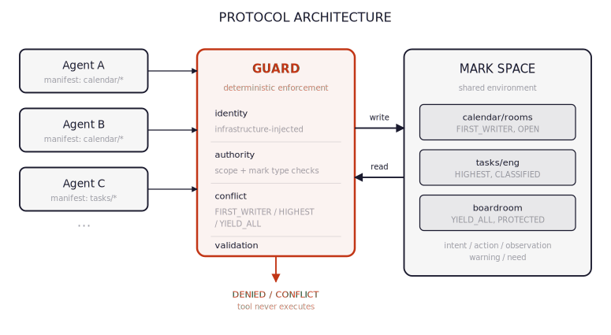
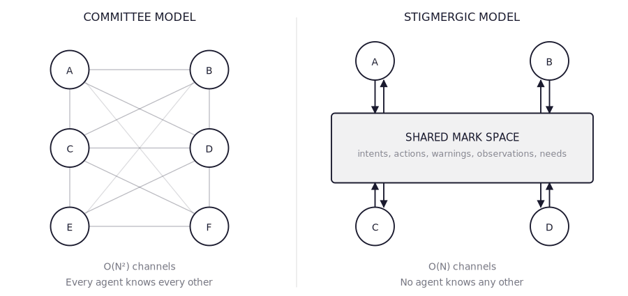
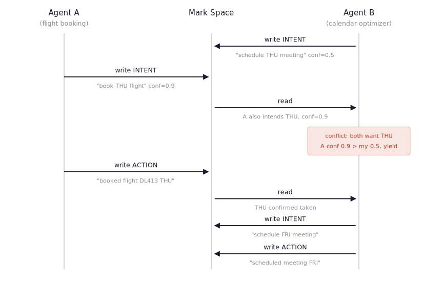
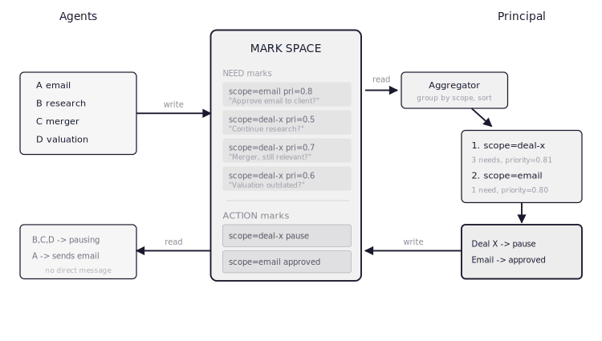
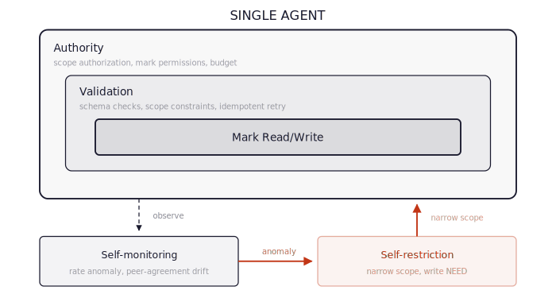
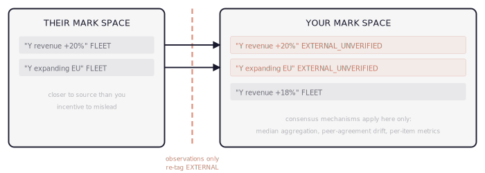

# Model Stigmergic Protocol (MSP)

<p align="center"></p>

> Bio-governed multi-agent coordination infrastructure.
> Agents don't talk to each other. They leave marks.


Most multi-agent LLM systems coordinate through message-passing: agents send structured messages to each other, and things break when agents lie, go stale, or get compromised. MSP takes a different approach, borrowed from termites, ant colonies, and the immune system — agents coordinate by leaving typed marks in a shared environment. No direct agent-to-agent communication. No honest-majority assumption. Safety enforced at the environment boundary, independent of what any agent does.

---

## Architecture

<p align="center"></p>

Five layers, each building on the last:

| Layer | Role | Key Components |
|---|---|---|
| **5 · Orchestration Ecosystem** | Planning, auditing, governance | PAUL · AEGIS · CARL · BASE · SEED · Skillsmith |
| **4 · Knowledge Integration** | Persistent knowledge, research synthesis | Obsidian VaultSync · NotebookLM |
| **3 · Multi-Provider Orchestration** | Agent identity, provider adapters, session memory | agent:// URI · ClaudeAdapter · CodexAdapter · GeminiAdapter · PSMM |
| **2 · Context Engineering** | Filesystem-based context hierarchy, tiered delivery | ICM · hot/warm/cold tiers · progressive disclosure |
| **1 · Coordination Core** | The shared environment all agents read and write | markspace · 5 mark types · guard · decay · trust · 66 formal properties |

Each layer depends only on the layers below it. You can adopt as much or as little of the stack as you need — use only Layer 1 as a coordination primitive, or run the full five-layer orchestration ecosystem.

---

## Layer 1 · Coordination Core

<p align="center"></p>

The coordination core is the markspace protocol — a stigmergic shared environment where agents read and write typed marks rather than messaging each other directly. A deterministic guard layer at the environment boundary enforces identity, scope, and conflict resolution independent of agent behavior. Safety guarantees hold even if individual agents are compromised, hallucinating, or adversarial.

### Five Mark Types

| Mark | Semantic Role |
|---|---|
| **Intent** | What an agent plans to do — scoped, time-bounded, conflict-guarded |
| **Action** | What an agent did — immutable record of completed work |
| **Observation** | What an agent learned — confidence-weighted, source-trusted |
| **Warning** | What an agent flagged as dangerous or anomalous |
| **Need** | What an agent requires from a principal or another agent |

<p align="center"></p>

### Core Properties

- **Guard layer** — deterministic authorization and conflict resolution at the write boundary, independent of agent compliance
- **Pheromone-style decay** — marks carry exponential decay; stale information fades without explicit invalidation
- **Trust weighting** — marks from fleet, verified, and unverified sources carry different epistemic weight
- **Adversarial validation** — tested to 1,050 agents under adversarial conditions
- **66 formal properties** — verified via property-based testing (Hypothesis)

### Attribution

> Built on **[markspace](https://github.com/opinionated-systems/markspace)** by Andre Loose / Opinionated Systems, Inc. (MIT) — the protocol foundation this entire stack is built on.
>
> Theoretical foundations: stigmergy concept — Grassé (1959); swarm intelligence — Bonabeau, Dorigo & Theraulaz (1999); blackboard architecture — Hayes-Roth (1985); Byzantine fault tolerance — Lamport, Shostak & Pease (1982).

---

## Layer 2 · Context Engineering

<p align="center"></p>

Context is delivered to agents through a five-layer filesystem hierarchy that replaces framework-level orchestration abstractions with plain directory structure. Each layer has a defined token budget and semantic contract — agents receive only what they need, progressively disclosed from global identity down to per-run artifacts.

### ICM Context Hierarchy

| Layer | Contents | Approx. Tokens |
|---|---|---|
| **0 · Global Identity** | CLAUDE.md / GEMINI.md / AGENTS.md — agent identity and global rules | ~800 |
| **1 · Workspace Routing** | Root CONTEXT.md — maps requests to stages | ~300 |
| **2 · Stage Contract** | Per-stage CONTEXT.md — inputs, process, outputs | 200–500 |
| **3 · Reference Material** | Stable config in `references/` and `_config/` | 500–2k |
| **4 · Working Artifacts** | Per-run content in `output/` folders | Variable |

### Hot / Warm / Cold Context Tiers

| Tier | Contains | Store | Access |
|---|---|---|---|
| **Hot** | Active intents, fresh observations, recent actions | In-memory | Every agent round |
| **Warm** | Older actions, supersession chains, resolved needs | PostgreSQL | On-demand |
| **Cold** | Expired intents, fully-decayed marks, archives | Cold storage | Audit only |

### Attribution

> Context hierarchy adapts **[ICM — Interpreted Context Methodology](https://github.com/RinDig/Interpreted-Context-Methdology)** by Jake Van Clief ([arXiv:2603.16021](https://arxiv.org/abs/2603.16021)) — *"Folder structure as agent architecture. ICM replaces framework-level orchestration with filesystem structure."*
>
> Filesystem-as-orchestration concept: **AFS — Agentic File System** ([arXiv:2512.05470](https://arxiv.org/abs/2512.05470)).

---

## Layer 3 · Multi-Provider Orchestration

<p align="center"></p>

Agents are identified by topology-independent URIs, not hostnames or session IDs. Any provider — Claude, Codex, Gemini, or others — plugs into the same adapter interface and participates in the same mark space.

### Agent Identity

```
agent://{trust-root}/{capability-path}/{unique-id}

# Examples
agent://ikay13/planning/architect/claude-opus-01
agent://ikay13/audit/security/gemini-flash-03
agent://ikay13/implementation/engineer/codex-01
```

### Provider Adapters

| Adapter | Provider | Protocol |
|---|---|---|
| `ClaudeAdapter` | Anthropic Claude | markspace LLMClient → JSON `{observations, needs, reasoning}` |
| `CodexAdapter` | OpenAI Codex | subprocess `codex exec` → same JSON protocol |
| `GeminiAdapter` | Google Gemini CLI | subprocess `gemini --prompt` → same JSON protocol |

### AgentSession + PSMM

`AgentSession` is the Layer 1+2+3 integration glue — it loads workspace context, injects Prior Session Memory (PSMM) from the previous round, runs the provider adapter, and writes resulting observations and needs back to the mark space. PSMM ensures agents don't start from scratch each session.

### Attribution

> Agent identity scheme ports **Rodriguez (2026)** — *Agent Identity URI Scheme: Topology-Independent Naming and Capability-Based Discovery for Multi-Agent Systems* ([arXiv:2601.14567](https://arxiv.org/abs/2601.14567)).
>
> MCP security gap research that informed the design: Bhatt et al. (2025) ([arXiv:2506.01333](https://arxiv.org/abs/2506.01333)) · Huang et al. (2026) ([arXiv:2603.07473](https://arxiv.org/abs/2603.07473)).

---

## Layer 4 · Knowledge Integration

```
Obsidian Vault  ↔  VaultSync  ↔  MarkSpace
```

Agent observations flow out to an Obsidian vault as structured notes. Vault notes tagged `#msp` flow back in as marks — closing a bidirectional loop between the live coordination environment and a persistent human-readable knowledge base. NotebookLM connects to the vault for research synthesis and audio summary generation.

### Attribution

> Knowledge layer integrates **[Obsidian](https://obsidian.md)** (local-first knowledge base with bidirectional links) and **[Google NotebookLM](https://notebooklm.google.com)** for research synthesis.

---

## Layer 5 · Orchestration Ecosystem

Six orchestration modules, each adapted and ported from standalone Claude Code tools by [@ChristopherKahler](https://github.com/ChristopherKahler), redesigned as stigmergic-native components that operate through markspace rather than direct agent messaging.

| Module | Description | Original Repo |
|---|---|---|
| **PAUL** | Plan-Apply-Unify loop — structured milestone-driven development with multi-provider task routing | [ChristopherKahler/paul](https://github.com/ChristopherKahler/paul) |
| **AEGIS** | 12-persona epistemic audit across 14 domains, 6 adversarial phases, real static codebase analysis | [ChristopherKahler/aegis](https://github.com/ChristopherKahler/aegis) |
| **CARL** | Context Augmentation & Reinforcement Layer — just-in-time domain rule injection via keyword matching | [ChristopherKahler/carl](https://github.com/ChristopherKahler/carl) |
| **BASE** | Builder's Automated State Engine — workspace state, drift detection, PSMM snapshots | [ChristopherKahler/base](https://github.com/ChristopherKahler/base) |
| **SEED** | Project ideation engine — type-aware guided exploration from raw idea to structured plan, ready for PAUL | [ChristopherKahler/seed](https://github.com/ChristopherKahler/seed) |
| **Skillsmith** | Capability standards, 7-file skill taxonomy, end-to-end compliance audit | [ChristopherKahler/skillsmith](https://github.com/ChristopherKahler/skillsmith) |

### Attribution

> Layer 5 adapts and ports six original tools by **[@ChristopherKahler](https://github.com/ChristopherKahler)**, redesigned as stigmergic-native orchestration modules that coordinate through markspace rather than direct agent messaging.

---

## Why Stigmergy?

<p align="center"></p>

Pierre-Paul Grassé coined "stigmergy" in 1959 studying termite mound construction. The word comes from Greek *stigma* (mark) and *ergon* (work) — coordination stimulated by marks left in a shared environment. No termite knows the building plan. Each one follows local rules: pick up mud, deposit where pheromone concentration is highest, move on. The structure emerges from the marks.

| Biological System | Mark Type | Decay Mechanism | Emergent Behavior | Scale |
|---|---|---|---|---|
| Ant foraging | Pheromone trail | Evaporation (minutes) | Shortest-path optimization | 10K–1M agents |
| Termite construction | Mud + pheromone | None (structural) | Complex architecture | 1M+ agents |
| Slime mold | Chemical gradient | Diffusion | Network optimization | 10⁹ cells |
| Immune system | Antigen presentation | Degradation | Distributed threat detection | 10¹² cells |

The common pattern: **no agent has global state.** Each agent reads local marks, applies local rules, writes local marks. Global behavior emerges from local interactions.

This is exactly the problem structure of LLM agent fleets — probabilistic agents, operating in environments where information goes stale, some of which may be adversarial. Message-passing coordination breaks under these conditions because it assumes agents are cooperative and context is losslessly transmitted. Stigmergic coordination doesn't make either assumption. The mark space *is* the shared world state. The guard enforces safety at the boundary. Decay handles staleness automatically.

<p align="center"></p>

---

## Installation

```bash
git clone https://github.com/ikay13/Model-Stigmergic-Protocol
cd Model-Stigmergic-Protocol
pip install -e .
```

Requires Python 3.10+. Verify the install:

```bash
python -m msp --help
```

---

## Usage

### Incubate a new project

```bash
python -m msp seed --type software --name myproject --goal "Build auth system"
```

Generates a structured `PLANNING.md` from a raw idea, ready for PAUL-managed development.

### Create a milestone-driven plan

```bash
python -m msp paul plan \
  --project myproject \
  --milestone "m1:Build auth:all auth tests pass"
```

Runs the Plan-Apply-Unify loop and writes `STATE.md` + `MILESTONES.md` to the workspace.

### Run a 6-phase epistemic audit

```bash
python -m msp aegis --project myproject
```

Runs AEGIS across 14 domains with 12 specialized personas. Findings written to `<project>/aegis/findings/`.

For deeper usage and architecture documentation see [planning/ARCHITECTURE.md](planning/ARCHITECTURE.md).

---

## Status


| What works today | What's next |
|---|---|
| All 5 layers implemented and tested | Protocol extraction — formalizing MSP/MMSP |
| 460 tests passing on Jetson Orin aarch64 | NotebookLM integration |
| CLI: `seed`, `paul plan`, `aegis` | Cross-provider coordination tests |
| Multi-provider adapters: Claude, Codex, Gemini | Phase 5: control theory + chaos formalization |
| Bidirectional Obsidian VaultSync | Lyapunov stability analysis of mark dynamics |

---

## License

- **Code:** MIT — see [LICENSE-MIT](LICENSE-MIT)
- **Documentation:** CC BY 4.0 — see [LICENSE-CC-BY-4.0](LICENSE-CC-BY-4.0)

---

## Citation

If you use MSP or the markspace coordination core in your research, please cite:

```bibtex
@software{markspace2026,
  title     = {Model-Stigmergic-Protocol},
  author    = {Kay, James Isaac},
  year      = {2026},
  version   = {0.1.0-alpha},
  url       = {https://github.com/ikay13/Model-Stigmergic-Protocol},
  license   = {MIT}
}
```

```bibtex
@software{markspace2026,
  title     = {markspace},
  author    = {Loose, Andre},
  year      = {2026},
  version   = {0.1.3-beta},
  doi       = {10.5281/zenodo.18990235},
  url       = {https://github.com/opinionated-systems/markspace},
  license   = {MIT}
}
```

See [planning/REFERENCES.md](planning/REFERENCES.md) for the full bibliography of research this project builds on.

---

## Acknowledgements

MSP is built on the shoulders of:

- **[markspace](https://github.com/opinionated-systems/markspace)** — Andre Loose / Opinionated Systems, Inc.
- **[ICM](https://github.com/RinDig/Interpreted-Context-Methdology)** — Jake Van Clief ([arXiv:2603.16021](https://arxiv.org/abs/2603.16021))
- **[AFS](https://arxiv.org/abs/2512.05470)** — Agentic File System research
- **[Agent Identity URI Scheme](https://arxiv.org/abs/2601.14567)** — Rodriguez (2026)
- **[@ChristopherKahler](https://github.com/ChristopherKahler)** — PAUL, AEGIS, CARL, BASE, SEED, Skillsmith
- Pierre-Paul Grassé (1959) — stigmergy
- The researchers listed in [planning/REFERENCES.md](planning/REFERENCES.md)
